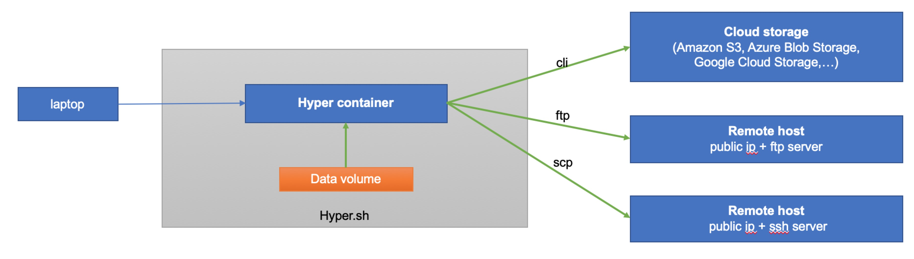

<!-- TOC depthFrom:1 depthTo:6 withLinks:1 updateOnSave:1 orderedList:0 -->

- [Instructions for data migration](#instructions-for-data-migration)
	- [Prerequisites](#prerequisites)
	- [Example](#example)
		- [SFTP/SSH Server](#sftpssh-server)
		- [AWS S3](#aws-s3)
		- [Google Cloud Storage](#google-cloud-storage)
		- [Azure Blob Storage](#azure-blob-storage)

<!-- /TOC -->



#  Instructions for data migration

- Install and config the command line tool in your running hyper container
- Upload volume data from the hyper container to your own server or cloud storage with cli

## Prerequisites

Any of the following

- You have your own file server
  - SFTP server with public IP
  - SSH server with public IP
- You have your own cloud storage
  - AWS S3
  - Google Cloud Storage
  - Azure Blob Storage
  - ...

## Example

### SFTP/SSH Server

You should have the IP, Port, username, and password of your own SFTP/SSH server.

Example: copy file from the hyper container to the SFTP server
```
$ hyper exec -it mycontainer sh
root@5cd5b9fe7b2a:~# which sftp
/usr/bin/sftp
root@5cd5b9fe7b2a:~# tar czvf /data/hello.tar.gz /data/hello.txt
root@5cd5b9fe7b2a:~# sftp -P 2222 /data/hello.tar.gz foo@209.177.93.134:/data
```

Example: copy file from  hyper container to the SSH server
```
$ hyper exec -it mycontainer sh
root@5cd5b9fe7b2a:~# which scp
/usr/bin/scp
root@5cd5b9fe7b2a:~# tar czvf /data/hello.tar.gz /data/hello.txt
root@5cd5b9fe7b2a:~# scp -P 2222 /data/hello.tar.gz foo@209.177.93.134:/data
```

If your server has keypairs, you can create the private key file in the hyper container.
```
$ hyper exec -it mycontainer sh
root@5cd5b9fe7b2a:~# which scp
/usr/bin/scp
root@5cd5b9fe7b2a:~#  cat > key.pem <<EOF
<content of the private key>
EOF
root@5cd5b9fe7b2a:~#  chmod 400 key.pem
root@5cd5b9fe7b2a:~# scp -i key.pem -P 2222 /data/hello.tar.gz foo@209.177.93.134:/data
root@5cd5b9fe7b2a:~# rm -rf key.pem
```

### AWS S3

REF:
- https://docs.aws.amazon.com/cli/latest/reference/s3/

Step:
- create a temporary credential with AWS console first, then you will get `AWS Access Key`  and  `AWS Secret Access Key`
- install and config aws cli in the hyper container
- compress files in the volume
- copy compressed file to s3

```
$ hyper exec -it mycontainer sh
root@5cd5b9fe7b2a:~# apt-get update
root@5cd5b9fe7b2a:~# apt-get install -y python-dev python-pip
root@5cd5b9fe7b2a:~# pip install awscli

root@5cd5b9fe7b2a:~# aws --profile temp configure
AWS Access Key ID [None]: xxx
AWS Secret Access Key [None]: xxx
Default region name [None]:
Default output format [None]:

root@5cd5b9fe7b2a:~# aws --profile temp s3 mb s3://hyper-backup-bucket

root@5cd5b9fe7b2a:~# aws --profile temp s3 cp /data/hello.txt s3://hyper-backup-bucket/data/hello.txt

root@5cd5b9fe7b2a:~# aws --profile temp s3 sync /data/ s3://hyper-backup-bucket/data/
```


### Google Cloud Storage

REF:
- https://cloud.google.com/storage/docs/quickstart-gsutil
- https://cloud.google.com/storage/docs/gsutil_install

Run the following command lines in the hyper container
```
// install gsutil
root@a52aa7ba39b4:/# curl https://sdk.cloud.google.com | bash


// init gcloud
root@a52aa7ba39b4:/# source /root/.bashrc
root@a52aa7ba39b4:/# gcloud init
...
Go to the following link in your browser:

    https://accounts.google.com/o/oauth2/auth?redirect_uri=urn%3Aietf%3Awg%3Aoauth%3A2.0%3Aoob&prompt=select_account&response_type=code&client_id=32555940559.apps.googleusercontent.com&scope=https%3A%2F%2Fwww.googleapis.com%2Fauth%2Fuserinfo.email+https%3A%2F%2Fwww.googleapis.com%2Fauth%2Fcloud-platform+https%3A%2F%2Fwww.googleapis.com%2Fauth%2Fappengine.admin+https%3A%2F%2Fwww.googleapis.com%2Fauth%2Fcompute+https%3A%2F%2Fwww.googleapis.com%2Fauth%2Faccounts.reauth&access_type=offline

Enter verification code: <get the code from the above link>
...


// create bucket
root@a52aa7ba39b4:/# gsutil mb -l us-east1 gs://hyper-backup-bucket/
Creating gs://hyper-backup-bucket/...

// copy file from hyper container to google cloud storage
root@a52aa7ba39b4:/# cd /home/backupdata/data/
root@a52aa7ba39b4:/home/backupdata/data# gsutil cp data.tar.gz gs://hyper-backup-bucket/
Copying file://data.tar.gz [Content-Type=application/x-tar]...
- [1 files][  123.0 B/  123.0 B]
Operation completed over 1 objects/123.0 B.
```


### Azure Blob Storage  

REF:
- https://docs.microsoft.com/en-us/azure/storage/common/storage-azure-cli#azure-cli-sample-script
- https://docs.microsoft.com/en-us/azure/storage/blobs/storage-quickstart-blobs-cli

> There is no example here, but it is similar to the example above.
