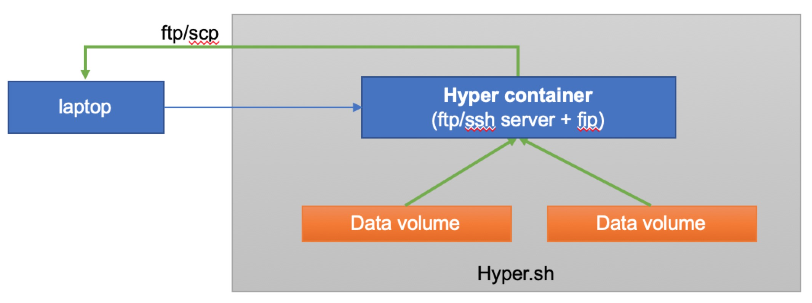

<!-- TOC depthFrom:1 depthTo:6 withLinks:1 updateOnSave:1 orderedList:0 -->

- [Instructions for data migration](#instructions-for-data-migration)
	- [Prerequisites](#prerequisites)
	- [Get volume name to backup](#get-volume-name-to-backup)
	- [Start a SFTP server](#start-a-sftp-server)
	- [Attach FIP](#attach-fip)
	- [Download file](#download-file)
	- [Delete the SFTP server](#delete-the-sftp-server)
- [Use util.sh](#use-utilsh)
- [FAQ](#faq)
	- [1. No more image quota for use](#1-no-more-image-quota-for-use)
	- [2. No more container quota for use](#2-no-more-container-quota-for-use)
	- [3. No more FIP quota for use](#3-no-more-fip-quota-for-use)
	- [4. How to get the SFTP account](#4-how-to-get-the-sftp-account)
	- [5. Can I use an encrypted password for SFTP](#5-can-i-use-an-encrypted-password-for-sftp)
	- [6. Can I change the SFTP docker image](#6-can-i-change-the-sftp-docker-image)
	- [7. No space left on volume](#7-no-space-left-on-volume)
	- [8. How to compress the data in volume](#8-how-to-compress-the-data-in-volume)
	- [9. Login SFTP Permission denied](#9-login-sftp-permission-denied)
	- [10. Permission issue of file or dir](#10-permission-issue-of-file-or-dir)

<!-- /TOC -->



#  Instructions for data migration

- Run the SFTP/SSH server in hyper.sh
- Download volume data from hyper.sh to your localhost


Here is an example of running the SFTP(It's safer than FTP) server in hyper.sh

We will use the docker image `atmoz/sftp` in this example:
- Dockerfile: https://github.com/atmoz/sftp
- Image on DockerHub : https://hub.docker.com/r/atmoz/sftp

## Prerequisites

- 1 quota to pull image `atmoz/sftp`
- 1 quota to run a container
- 1 quota to allocate a fip

## Get volume name to backup

```
//show all data volume
$ hyper volume ls
DRIVER              NAME                                                              SIZE     CONTAINER
hyper               data                                                              10 GB    074b88d328082c01d50e65580385a91fc2ecfae105f935291df66c44c42acb4e
hyper               95c10ca3f04efd493f9c946df9d3a65aace0f289cb7d4a0730424cc4846c5e7   10 GB
```

if the volume is attached to a hyper container, please delete the container without -v
```
$ hyper rm -f 074b88d328082c01d50e65580385a91fc2ecfae105f935291df66c44c42acb4e
074b88d328082c01d50e65580385a91fc2ecfae105f935291df66c44c42acb4e
NOTICE : attached volume(data) is not deleted

//show all data volume again
DRIVER              NAME                                                             SIZE      CONTAINER
hyper               data                                                             10 GB
hyper               95c10ca3f04efd493f9c946df9d3a65aace0f289cb7d4a0730424cc4846c5e7  10 GB
```

## Start a SFTP server

start a SFTP server container with volume mounted in hyper.sh

```
$ SFTP_USER="backupdata"          # You can change the username
$ SFTP_PWD="temppassword"         # Don't use the password in this example
$ SFTP_PORT="2222"                # Set the port of the SFTP server
$ VOL_LIST=

$ for vol in data 95c10ca3f04efd493f9c946df9d3a65aace0f289cb7d4a0730424cc4846c5e7
do
  VOL_LIST="-v ${vol}:/home/${SFTP_USER}/${vol} ${VOL_LIST}"
done

$ hyper run -d --name sftpserver ${VOL_LIST} -p ${SFTP_PORT}:22 atmoz/sftp "${SFTP_USER}:${SFTP_PWD}:1001:0"

// for zsh
$ eval "hyper run -d --name sftpserver ${VOL_LIST} -p ${SFTP_PORT}:22 atmoz/sftp \"${SFTP_USER}:${SFTP_PWD}:1001:0\""
```

> SFTP user is the same user group as root here

If you want to use an encrypted password when running hyper container, please go to  [FAQ5](#5can-i-use-an-encrypted-password-for-sftp)

## Attach FIP

attach a public IP to the SFTP server container container

```
//If you have an unused FIP
$ FIP=$(hyper fip ls -f dangling=true | grep -v Floating | head -n 1)

//If you have used FIP, please detach one from a container, then run the above command line again
$ hyper fip detach <container>

//If you have no FIP, please allocate a new one.
$ FIP=$(hyper fip allocate -y 1)

//Attach the FIP to the SFTP server container
$ hyper fip attach ${FIP} sftpserver
```

## Download file

Copy file from SFTP server to localhost
```
//root dir for SFTP is '/home/${SFTP_USER}', all volumes are mounted in this dir.

//for example:
//'data' is the volume name, the full file path in the container is /home/backupdata/data/hello.txt, so the path of SFTP is /data/hello.txt

//non-interactive mode
$ sftp -P ${SFTP_PORT} ${SFTP_USER}@${FIP}:/data/hello.txt .

//interactive mode
$ sftp -P ${SFTP_PORT} ${SFTP_USER}@${FIP}
backupdata@209.177.92.169's password:
Connected to backupdata@209.177.92.169.
sftp> ls
data
sftp> get data/data.tar.gz
Fetching /data/data.tar.gz to data.tar.gz
/data/data.tar.gz                                                100%  123     0.4KB/s   00:00
sftp> !ls -l hello.tar.gz
-rw-r--r--  1 xjimmy  staff  45 12 20 15:44 hello.tar.gz
sftp> exit
```
> When the terminal prompts for a password for SFTP, please enter the value of `SFTP_PWD`

## Delete the SFTP server

```
$ hyper rm -f sftpserver
sftpserver
NOTICE : attached volume(data) is not deleted
NOTICE : attached volume(95c10ca3f04efd493f9c946df9d3a65aace0f289cb7d4a0730424cc4846c5e7) is not deleted
```

# Use util.sh

To facilitate the creation of SFTP server, we also provide a script `util.sh`.

You can download the script here: [util.sh](util.sh)

After you download this script, please set the file mode: `chmod +x util.sh`

Here is the usage:
```
// If you do not use the default hyper config, you can modify the HYPER_BIN variable in uitl.sh

// start a SFTP server container in hyper.sh, then copy the files in the volume from hyper.sh to localhost
$ ./util.sh generate            # genereate SFTP password
$ ./util.sh start vol1 vol2     # start SFTP server container, run 'hyper volume ls' to get the volume name
$ ./util.sh view                # get SFTP server IP and account

$ sftp -P 2222 backupdata@209.177.92.169:/vol1/file1 .   # root dir for SFTP is '/home/backupdata', all volumes are mounted in this dir.

//download file with non-interactive mode
$ sftp -P 2222 backupdata@209.177.92.169:/vol1/file1 .   # root dir for SFTP is '/home/backupdata', all volumes are mounted in this dir.

//download dir with interactive mode
$ sftp -P 2222 backupdata@209.177.92.169
sftp> ls
sftp> get -Pr *
sftp> exit

// delete SFTP server container, fip, and SFTP server password file
$ ./util.sh clean
```

> A fip will be attached to the SFTP server container automatically, in this case, the fip is `209.177.92.169`  

> The script was tested under MacOS and CentOS.

# FAQ

## 1. No more image quota for use

Please delete an image
```
$ hyper rmi <image>
```

## 2. No more container quota for use

Please delete a container
```
//If you want to delete volumes mounted on the container, you can run:
$ hyper rm -fv <container>

//If you want to keep the volume data, just run:
$ hyper rm -f <container>
```

## 3. No more FIP quota for use

Please detach the using FIP from your container
```
$ hyper fip detach <container>
```

## 4. How to get the SFTP account

You can run the following command  line
```
$ ./util.sh view
```

## 5. Can I use an encrypted password for SFTP

Yes
```
// generate passwords
$ hyper pull atmoz/makepasswd
$ RESULT=$(hyper run -it --rm atmoz/makepasswd --crypt-md5)
$ SFTP_PWD=$(echo -n $RESULT | awk '{print $1}')
$ SFTP_CRYPT_PWD=$(echo -n $RESULT | awk '{print $2}' | tr -d "\\r")

//start the SFTP server container with an encrypted password
$ hyper run -d --name sftpserver \
    ${VOL_LIST} \
    -p ${SFTP_PORT}:22 \
    atmoz/sftp "${SFTP_USER}:${SFTP_CRYPT_PWD}:e:1001"
```
> You can also use the local docker daemon to run the `atmoz/makepasswd` container.

> SFTP_PWD is the plain password for login SFTP_PWD  
> SFTP_CRYPT_PWD is the encrypted password for start SFTP server container


## 6. Can I change the SFTP docker image

Yes
```
The `util.sh` script uses two docker images:
- atmoz/sftp
- atmoz/makepasswd

Here is the Dockerfile
- https://github.com/atmoz/sftp
- https://github.com/atmoz/makepasswd

You can also build both images by yourself, then push them to docker hub.
Then update the value of MKPWD_IMAGE_NAME and SFTP_IMAGE_NAME in the `util.sh` script.
```

## 7. No space left on volume

- create a volume with enough space
- mount it to the SFTP server container

```
//create a new volume
$ hyper volume create --name vol-backup --size 20

//delete old sftpserver container
$ ./util.sh delete

//create a new sftpserver container with the new volume
$ ./util.sh start vol-backup data 95c10ca3f04efd493f9c946df9d3a65aace0f289cb7d4a0730424cc4846c5e7

$ hyper exec -it sftpserver df -hT | grep home
/dev/sda       ext4      9.8G  137M  9.1G   2% /home/backupdata/data
/dev/sdb       ext4       20G   45M   19G   1% /home/backupdata/vol-backup     <<<<<<<<<< this is the new volume
/dev/sdc       ext4      9.8G  137M  9.1G   2% /home/backupdata/95c10ca3f04efd493f9c946df9d3a65aace0f289cb7d4a0730424cc4846c5e7
```

## 8. How to compress the data in volume

- enter the sftpserver container
- cd the data dir
 - SFTP root dir is `/home/backupdata`
 - all volume will be mounted in this dir
- compress the file

```
$ hyper exec -it sftpserver bash
root@5a7d578f7969:/# cd /home/backupdata
root@5a7d578f7969:/home/backupdata# ls -l
total 8
drwxr-xr-x 2 root root 4096 Dec 19 06:59 95c10ca3f04efd493f9c946df9d3a65aace0f289cb7d4a0730424cc4846c5e7
drwxr-xr-x 2 root root 4096 Dec 19 06:59 data
root@5a7d578f7969:/home/backupdata# tar czvf data/hello.tar.gz data/hello.txt
data/hello.txt
root@5a7d578f7969:/home/backupdata# ls -l data
total 102500
-rw-r--r-- 1 root root    101878 Dec 19 13:44 hello.tar.gz
-rw-r--r-- 1 root root 104857600 Dec 19 13:39 hello.txt
```

## 9. Login SFTP Permission denied

I changed the SFTP username to `backup`, but when I copy file, the error occur:
```
backupdata@199.245.56.54's password:
Permission denied, please try again.
```

The cause is the `backup` is an existing username, the following usernames cannot be used as SFTP username in this SFTP server container
```
root, daemon, bin, sys, sync, games, man, lp, mail, news, uucp, proxy, www-data,
backup, list, irc, gnats, nobody, _apt, messagebus, sshd,
systemd-timesync, systemd-network, systemd-resolve, systemd-bus-proxy
```

## 10. Permission issue of file or dir

**case1: file permission**
```
$ sftp -P 2222 backupdata@209.177.92.169:/data/hello.txt .
backupdata@209.177.92.169's password:
Connected to 209.177.92.169.
Fetching /data/hello.txt to ./hello.txt
remote open("/data/hello.txt"): Permission denied
Connection closed.
```
Cause: sftp user has no permission to access file `hello.txt`
Solution1. change the mode of the file, for example
```
$ hyper exec -it sftpserver bash
root@a52aa7ba39b4:/# cd /home/backupdata/
root@a52aa7ba39b4:/home/backupdata# chmod g+r -R data/*
```
If you don't want to change your file mode, you can use solution2.

Solution2. compress the files, for example:
```
$ hyper exec -it sftpserver bash
root@a52aa7ba39b4:/# cd /home/backupdata/data
root@a52aa7ba39b4:/home/backupdata/data# tar czvf data.tar.gz *
```

**case2: dir permission**
```
$ sftp -P 2222 backupdata@209.177.92.169:/data/hello.txt .
backupdata@209.177.92.169's password:
Connected to 209.177.92.169.
File "/data/hello.txt" not found.
Connection closed.

or

$ sftp -P 2222 backupdata@209.177.92.169
backupdata@209.177.92.169's password:
Connected to backupdata@209.177.92.169.
sftp> cd data
sftp> ls
remote readdir("/data"): Permission denied
sftp>
```
Cause:  sftp user has no permission to access volume mount dir `data`
Solution: change the mode of the dir, for example:
```
$ hyper exec -it sftpserver bash
root@a52aa7ba39b4:/# cd /home/backupdata/
root@a52aa7ba39b4:/home/backupdata# chmod g+rx data
```
